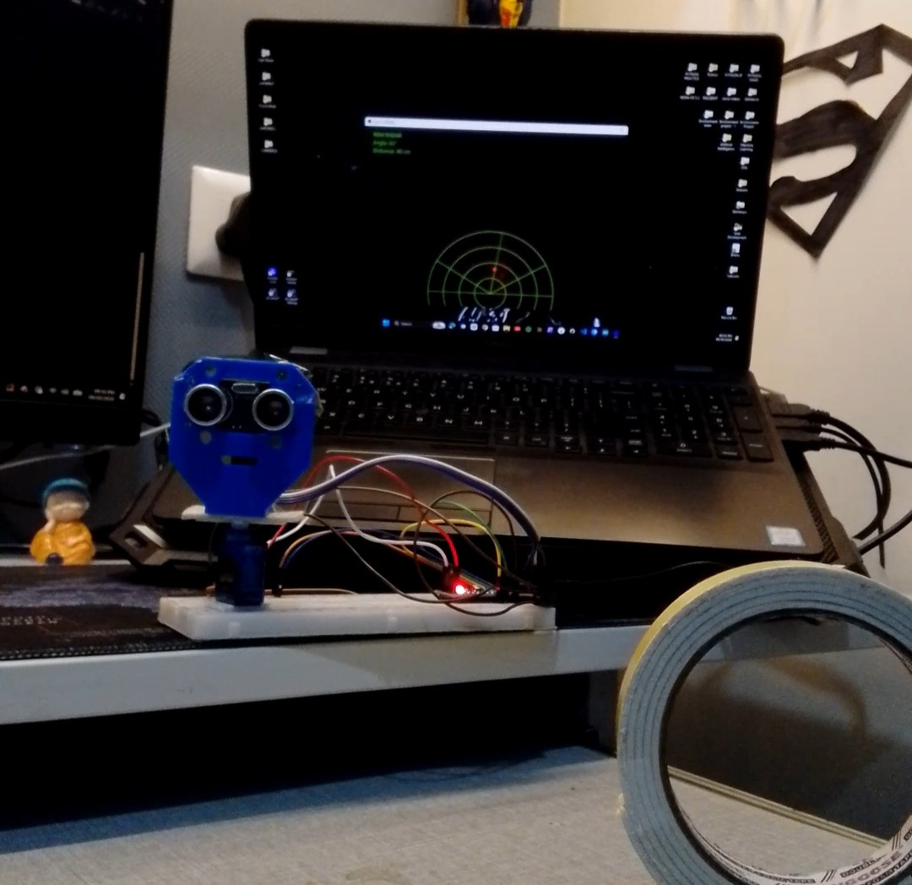

# Mini Radar

Mini Radar is an Arduino project that uses an ultrasonic sensor mounted on a servo motor to scan for nearby objects.

The Arduino measures the distance while the servo moves the sensor through different angles. The angle and distance values are sent to a laptop through serial communication.

## Current Progress

* Servo scanning works
* HC-SR04 distance measurement works
* Angle and distance values are visible through Serial Monitor
* Laptop radar visualization is planned as the next step

## Components

* Arduino Nano
* HC-SR04 ultrasonic sensor
* SG90/MG90 servo motor
* Jumper wires
* USB cable
* Laptop

## Assembly

1. Place the Arduino Nano on the breadboard.
2. Connect the HC-SR04 ultrasonic sensor to the Arduino Nano.
3. Connect the SG90 servo motor to the Arduino Nano.
4. Mount the HC-SR04 on the servo motor.
5. Connect the Arduino Nano to the laptop using the USB cable.
6. Upload `mini_radar.ino` using the Arduino IDE.
7. Open `radar_visualization.pde` in Processing.
8. Run the Processing sketch to display the radar.

## Connections

### HC-SR04

| HC-SR04 | Arduino Nano |
| ------- | ------------ |
| VCC     | 5V           |
| GND     | GND          |
| TRIG    | D7           |
| ECHO    | D6           |

### Servo

| Servo  | Arduino Nano |
| ------ | ------------ |
| Signal | D9           |
| VCC    | 5V           |
| GND    | GND          |

## How It Works

The servo rotates the ultrasonic sensor from one side to the other.

The HC-SR04 sends an ultrasonic pulse and measures how long it takes for the echo to return. The Arduino converts this into an approximate distance.

The Arduino then sends the angle and distance through serial communication at 9600 baud.

Example:

```text
180,42
179,41
178,40
177,38
```

The first value is the servo angle and the second value is the distance in centimetres.

## Software

The Arduino code is written in C++ using the Arduino IDE.

The laptop visualization will be made using Processing in the next stage of the project.

## Files

* `mini_radar.ino` — Arduino code for the servo and ultrasonic sensor
* `radar_visualization.pde` — laptop visualization for the next stage

## Next Step

The next part of the project is to use the serial data from the Arduino to create a real-time radar display on the laptop.

## Finished Build



## Working Demo

[Watch the Mini Radar working](20260930_213449.mp4)

## Circuit Diagram 

Circuit Diagram : 

## What I Learned

This project helped me understand servo control, ultrasonic distance measurement and serial communication between an Arduino and a computer.

